# 多电机控制

> *工程训练IIB  风力摆A组-多电机控制*
>
> *天津理工大学*
>
> *作者：TheWindSing*
>
> *邮箱：thewindsing.zwx@qq.com*
>
> *版本：1.1*
>
> *时间：2024-1-6*

## 器件说明

### 主控单片机

#### 型号：

STC89C52RC

#### 参考:

[宏晶 STC89C52RC 微控制器实践小书]( [宏晶 STC89C52RC 微控制器实践小书 - UinIO.com 电子技术博客](http://www.uinio.com/Embedded/STC89C52/) )

#### 51最小系统图：

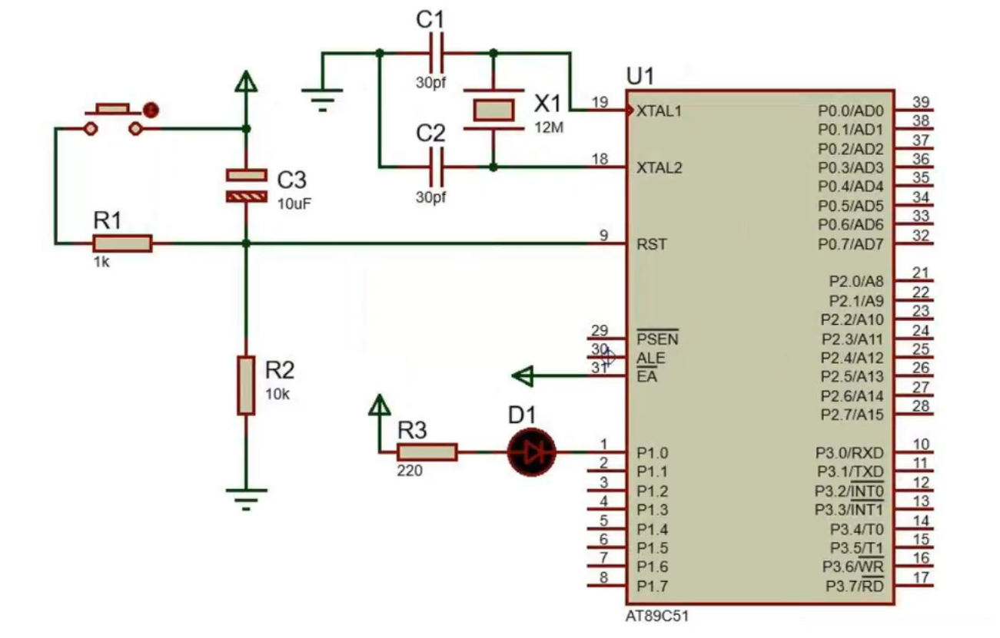


#### 接口图:

 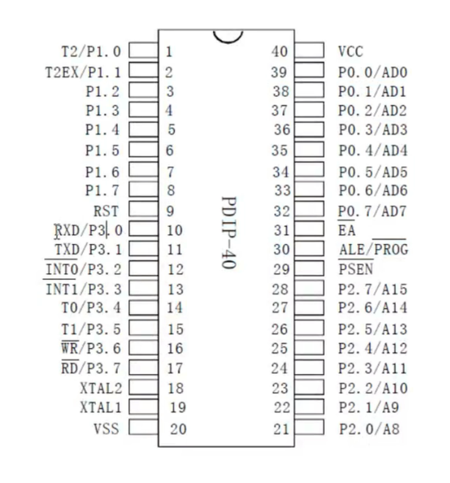


### 电机驱动芯片

#### 型号：

TC1508A

#### 实物图：

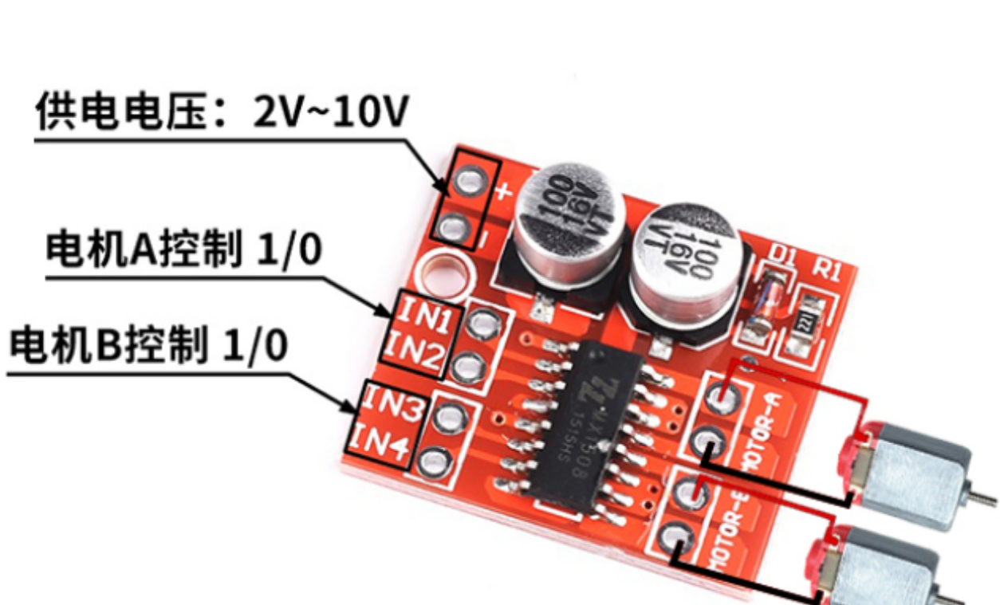


### 其他

* 杜邦线若干
* 几个不确定阻值的电阻
* 1个按钮开关

___

## 功能实现

### 单电机单向控制

#### 在Keil中新建STC工程：

> 一般直接安转完Keil软件中是没有STC的数据库，所以需要我们手动添加。
>
> 部分转载[KEIL中怎样添加STC系列单片机](https://blog.csdn.net/hpf247/article/details/68936084)

打开STC-ISP软件,然后点击Keil仿真设置，点击添加型号和头文件到Keil中 添加STC仿真器驱动到Keil中。

如下图：


之后弹出这个方框，选择好路径。

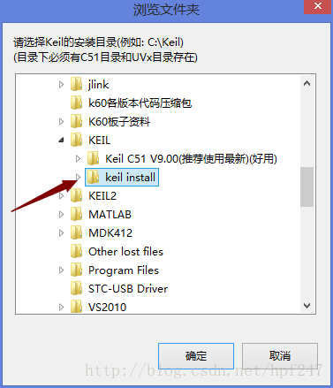

**选择你Keil软件安装的路径！**

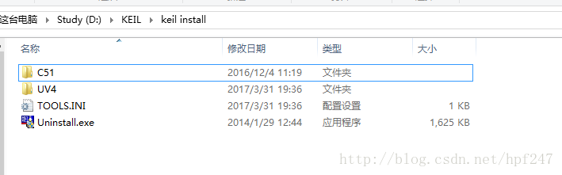

打开Keil软件，选择新建工程，它就会弹出下面这个界面，这时候就可以选择STC MCU Database进行选择STC系列的单片机了。
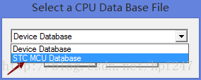

选择STC89C52单片机：
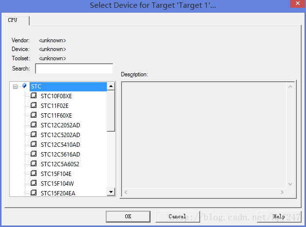


#### 代码：

```c
#include <reg52.h>
#define uchar unsigned char
#define uint unsigned int
sbit LED = P2^0;

void DelayMS(uint x)
{
	uchar i;
	while(x--)
	{
		for(i=120;i>0;i--);
	}
}
void main()
{
	while(1)
	{
		LED = ~LED;
		DelayMS(150);
	}
}
```

### 单电机多向控制

> 实际上可以在Keil这个EDA软件里面直接修改然后写出多电机控制的程序
>
> 但是，这里建议采用VScode、Sublime Text、Notepad++等编辑器做进一开发，有利于代码编写和文件管理。

#### VScode教程：

下载Embedded IDE插件，还可以添加Copilot和C语言编程等插件

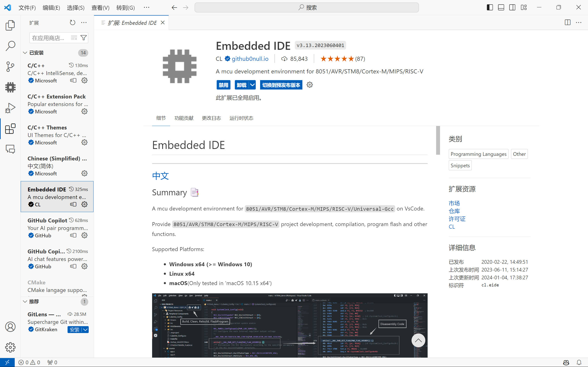

设置工具链：

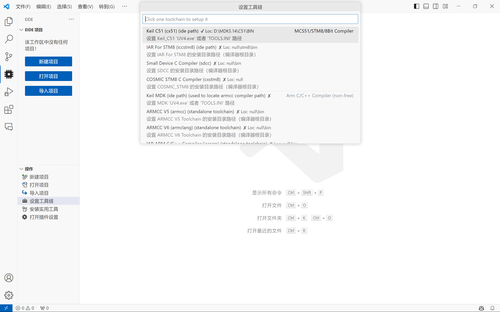

依次新建好项目：


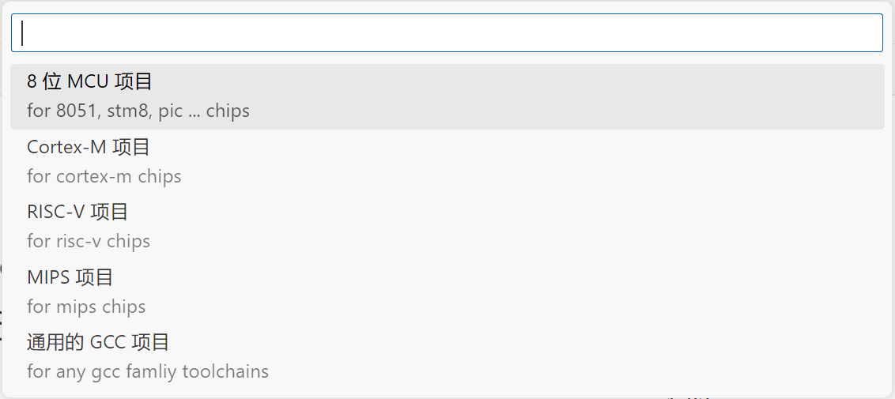

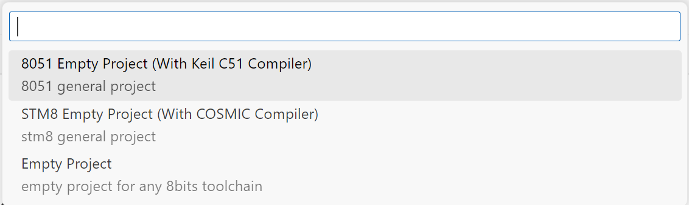

打开项目则需要切换到项目工作区：

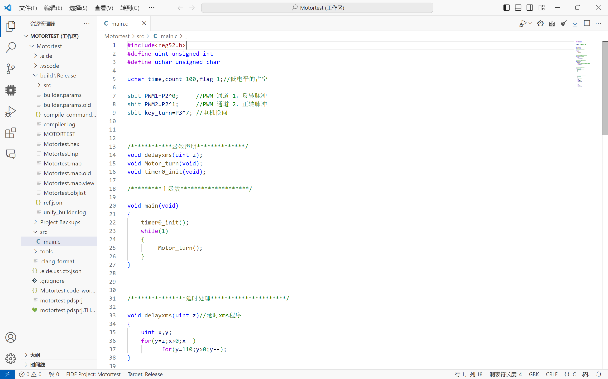


#### 控制一个电机正反方向旋转代码：

```c
#include<reg52.h>
#define uint unsigned int
#define uchar unsigned char

uchar time,count=100,flag=1;//低电平的占空

sbit PWM1=P2^0;		//PWM 通道 1，反转脉冲
sbit PWM2=P2^1;		//PWM 通道 2，正转脉冲
sbit key_turn=P3^7; //电机换向


void delayxms(uint z);
void Motor_turn(void);
void timer0_init(void);

void main(void)
{
	timer0_init();
	while(1)
	{
		 Motor_turn();
	}
}

void delayxms(uint z)//延时xms程序
{
    uint x,y;
    for(y=z;x>0;x--)
          for(y=110;y>0;y--);
}

void Motor_turn(void)	//电机换向控制
{
	if(key_turn==0)
	 {
	    delayxms(2);//此处可有可无，但是时间不能太长，否者会的中断产生冲突
	    if(key_turn==0)flag=~flag;
	    while(!key_turn);
	 }
}

void timer0_init(void)	//定时器0初始化
{
	TMOD=0x01; //定时器0工作于方式1
	TH0=(65536-10)/256;
	TL0=(65536-10)%256;
	TR0=1;
	ET0=1;
	EA=1;
}

void timer0_int(void) interrupt 1	//定时器0中断函数
{
	TR0=0;//设置定时器初值期间，关闭定时器
	TH0=(65536-10)/256;
	TL0=(65536-10)%256;
	TR0=1;

	if(flag==1)//电机正转
	{
		PWM1=0;
		time++;
		if(time<count)PWM2=1;
		else  PWM2=0;
		
		if(time>=100)time=0;
	}

	else //电机反转
	{
		PWM2=0;
		time++;
		if(time<count) PWM1=1;
		else PWM1=0;
		
		if(time>=100)time=0;
	}
}
```

#### 电路布局：

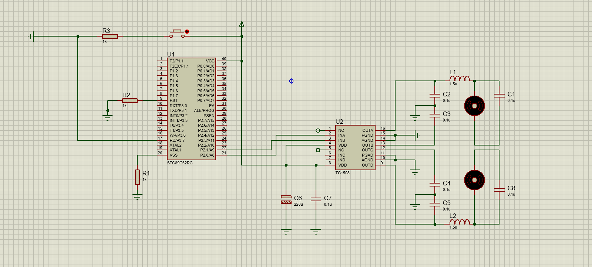

> 这里由于器件限制省略了复位部分，器件充足的情况下最好加上。

### 多电机多向控制

#### Porteus画电路图：

由于Porteus没有STC89C52和TC1508等器件，可以用如AT89C52等其他类似器件代替，或者自己制作示意元件封装。

> 这里只需画出示意电路，故简单选择后者。
>
> [自己制作元件并进行封装](https://blog.csdn.net/mx1691049567/article/details/122070970) 

#### 添加部分代码：

```c
// ...
sbit PWM1=P2^0;		//PWM 通道 1，反转脉冲
sbit PWM2=P2^1;		//PWM 通道 2，正转脉冲
sbit PWM3=P2^2;		//PWM 通道 3，反转脉冲
sbit PWM4=P2^3;		//PWM 通道 4，正转脉冲
// ...
void timer0_int(void) interrupt 1	//定时器0中断函数
{
	TR0=0;//设置定时器初值期间，关闭定时器
	TH0=(65536-10)/256;
	TL0=(65536-10)%256;
	TR0=1;

	if(flag==1)//电机正转
	{
		PWM1=0;
		PWM3=0;
		time++;
		if(time<count)PWM2=1;
		else  PWM2=0;
		
		if(time>=100)time=0;
	}

	else //电机反转
	{
		PWM2=0;
		PWM4=0;
		time++;
		if(time<count) PWM1=1;
		else PWM1=0;
		
		if(time>=100)time=0;
	}
}
// ...
```

#### 电路图：

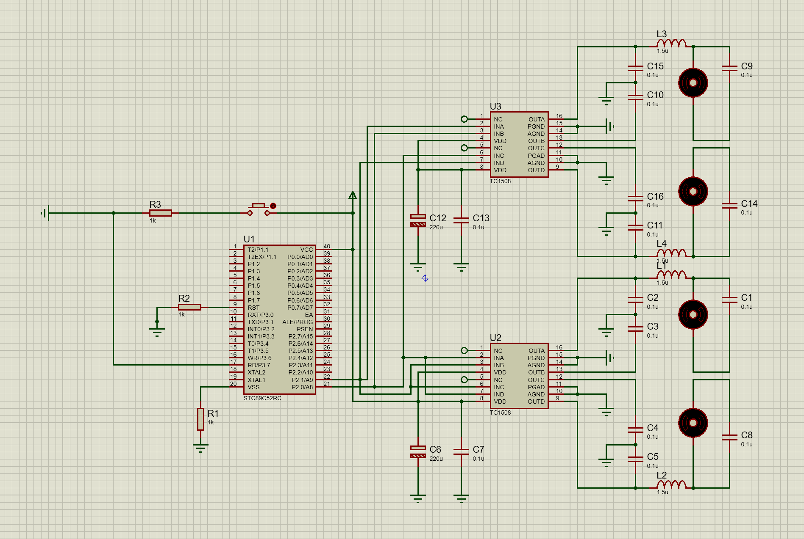

> 因为只有一个按钮，所以想控制多种运动方式只能直接自己上手拔线了。。。TUT
>
> 就此，通过手动拔线控制已经可以实现前后左右以及斜向45°八个方向的摆动了。
>